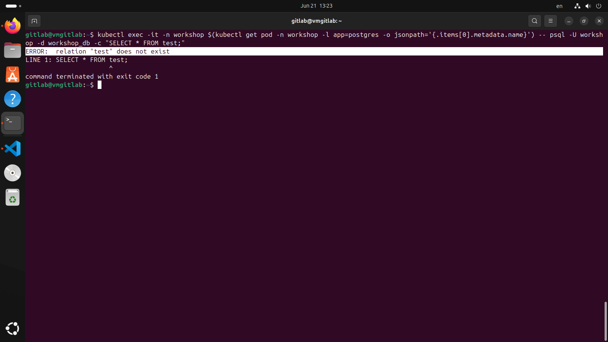
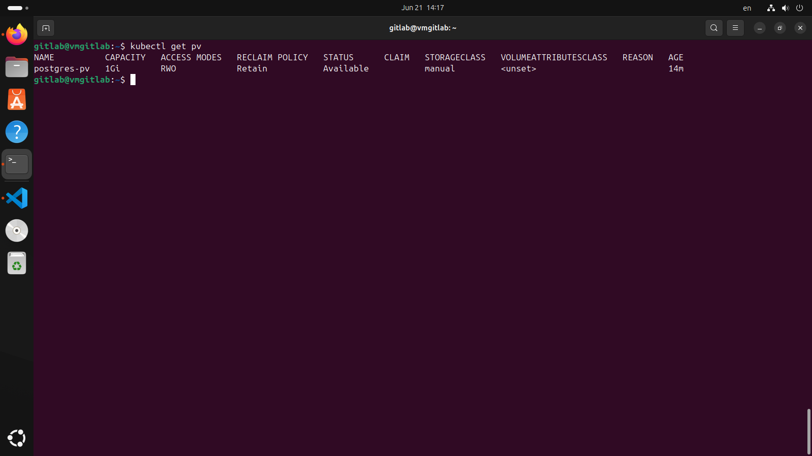
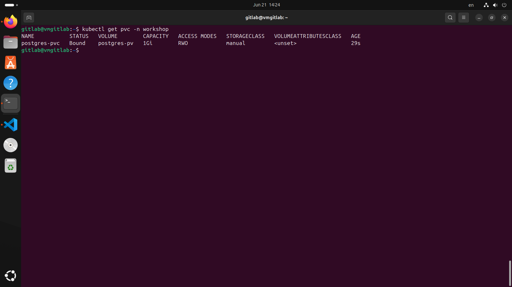
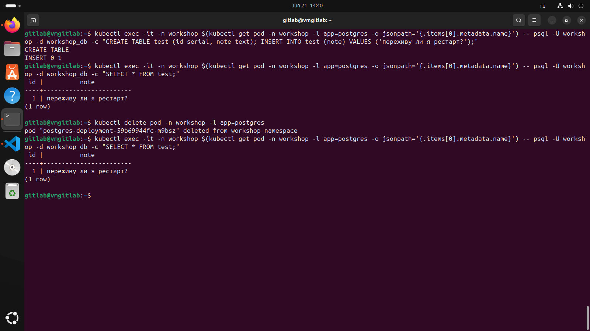
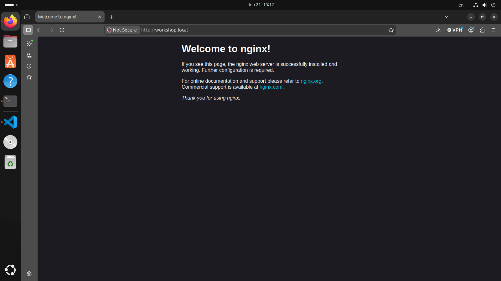

## Проблема которую мы решаем

Демонстрация проблемы с данными

Прежде чем чинить — убеждаемся, что проблема реальна. Заходим в PostgreSQL и создаем тестовые данные:
```
kubectl exec -it -n workshop $(kubectl get pod -n workshop -l app=postgres -o jsonpath='{.items[0].metadata.name}') -- psql -U workshop -d workshop_db -c "CREATE TABLE test (id serial, note text); INSERT INTO test (note) VALUES ('переживу ли я рестарт?');"
```
Проверяем, что данные на месте:
```
kubectl exec -it -n workshop $(kubectl get pod -n workshop -l app=postgres -o jsonpath='{.items[0].metadata.name}') -- psql -U workshop -d workshop_db -c "SELECT * FROM test;"
```
Убиваем ПОД, деплоймент пересоздает его автоматичски:
```
kubectl delete pod -n workshop -l app=postgres
```
Проверяем данные:
```
kubectl exec -it -n workshop $(kubectl get pod -n workshop -l app=postgres -o jsonpath='{.items[0].metadata.name}') -- psql -U workshop -d workshop_db -c "SELECT * FROM test;"
```
Получаем вывод:
```
ERROR:  relation "test" does not exist
```


Почему так происходит: Контейнер пишет данные в собственную файловую систему, которая существует только пока живёт контейнер. Когда Pod пересоздаётся — создаётся новый контейнер с чистой файловой системой. Это поведение Docker, и Kubernetes его не меняет — он просто оркестрирует контейнеры, а не данные внутри них.

## Теория. Три уовня абстракции

1. PersisentVolume(PV) - Реальный кусок диска. Существует на уровне всего кластера.
2. PersistentVolumeClaim(PVC) - Запрос на место. Существует в namespace.
3. StorageClass - Шаблон по которому PV создается автоматически, по запросу PVC

Под не обращается к PV напрямую - только через PVC. PVC. Это разделение позволяет администратору управлять реальным диском (NFS, AWS EBS, GCP Disk).

Я создаю PV вручную специально, чтобы увидеть механику изнутри, прежде чем доверять её автоматике.

## Подготовка директории на ноде

PersistentVolume в нашем случае будет указывать на реальную папку на диске Minikube-ноды
```
minikube ssh "sudo mkdir -p /mnt/data/postgres"
```

## Создаем PersistenVolume

[09_postgres_pv.yaml](manifests/09_postgres_pv.yaml)

```
1. kubectl apply -f manifests/09_postgres_pv.yaml
2. kubectl get pv
```


## Создаем PersistentVolumeClaim

[10_postgres_pvc.yaml](manifests/10_postgres_pvc.yaml)

```
1. kubectl apply -f manifests/10_postgres_pvc.yaml
2. kubectl get pvc -n workshop
```

STATUS: Bound — это ключевой момент. Kubernetes нашёл PV, который подходит под запрос PVC (тот же storageClassName, достаточный размер, совпадающий accessMode), и связал их. Если бы подходящего PV не было — статус остался бы Pending.



## Подключаем PVC к Deployment PostgreSQL

[04_db_deloyment.yaml](manifests/04_db_deployment.yaml)

```
1. kubectl apply -f manifests/04_db_deployment.yaml
2. kubectl get pods -n workshop -w
```
Разбор новых полей:
```
yaml
volumeMounts:
- name: postgres-storage          # ссылается на volumes ниже
  mountPath: /var/lib/postgresql/data   # куда монтируется внутри контейнера
  subPath: postgres                # подпапка внутри volume
```
mountPath — это путь внутри контейнера, по которому PostgreSQL хранит файлы базы данных. Это требование самого образа postgres — он всегда пишет данные именно туда.

subPath — важная деталь, которую часто упускают. Если примонтировать hostPath напрямую в корень /var/lib/postgresql/data, файловая система Linux может положить туда служебную папку lost+found, и PostgreSQL откажется стартовать, посчитав директорию "не пустой для инициализации". subPath: postgres создаёт подпапку внутри volume и монтирует именно её — это решает проблему.
```
yaml
volumes:
- name: postgres-storage
  persistentVolumeClaim:
    claimName: postgres-pvc      # имя PVC, который мы создали в шаге 2.3
```
Это объявление тома на уровне пода, volumeMounts внутри контейнера лишь ссылается на это имя — так одна и та же декларация volume может быть примонтирована сразу в несколько контейнеров одного пода, если их несколько.

## Проверяем что данные сохраняются

Выполняем команды из демонстрации проблемы



## Ingress - нормальный доступ к приложению

Проблема с NodePort

Сейчас доступ к приложению идёт так:
```
minikube service app-service -n workshop
```
Это работает, но не масштабируется на реальные сценарии:
1. Порт каждый раз случайный (в диапазоне 30000-32767)
2. Нет возможности использовать домен вроде myapp.com
3. Нет возможности направить /api на один сервис, а / на другой
4. В облаке NodePort требует знать IP конкретной ноды, что неудобно и нестабильно

Ingress решает все эти проблемы — это HTTP-роутер уровня приложения, который умеет анализировать домен и путь запроса.

## Создаем Ingress объект

[11_app_ingress.yaml](manifests/11_app_ingress.yaml)

```
1. kubectl apply -f manifests/11_app_ingress.yaml
2. kubectl get ingress -n workshop
```
Разбор полей:

```
spec:
  ingressClassName: nginx     # какой Ingress Controller обрабатывает правило
```

В кластере может быть несколько Ingress Controller'ов одновременно (nginx, Traefik, AWS ALB). ingressClassName указывает, какой из них должен обслуживать именно это правило. У нас установлен только nginx-controller, поэтому используем nginx.

```
rules:
  - host: workshop.local      # на какой домен реагировать
    http:
      paths:
      - path: /                # на какой путь URL
        pathType: Prefix        # как сопоставлять путь
        backend:
          service:
            name: app-service   # куда направить трафик
            port:
              number: 80
```

pathType: Prefix означает "путь и всё, что после него". То есть path: / поймает абсолютно любой запрос. Если бы я написал path: /api, поймались бы /api, /api/users, /api/anything.

annotations.rewrite-target: / — специфичная для nginx-контроллера настройка, которая переписывает путь запроса перед отправкой в Service. Для моего простого проекта с одним путём / это не критично, но это стандартная практика, которая пригодится, когда я добавлю второй сервис на путь /api.

## Настройка доступа по домену

В реальном интернете DNS-сервер переводит google.com в IP-адрес. У меня своего DNS нет, поэтому я пропишу соответствие вручную через файл /etc/hosts — он работает как локальная подмена DNS.

```
echo "$(minikube ip) workshop.local" | sudo tee -a /etc/hosts
```

## Проверка доступа к домену

Если строки успешно добавлены, то команда 
```
curl http://workshop.local
```

дает вывод:
```
<!DOCTYPE html>
<html>
<head>
<title>Welcome to nginx!</title>
<style>
html { color-scheme: light dark; }
body { width: 35em; margin: 0 auto;
font-family: Tahoma, Verdana, Arial, sans-serif; }
</style>
</head>
<body>
<h1>Welcome to nginx!</h1>
<p>If you see this page, the nginx web server is successfully installed and
working. Further configuration is required.</p>

<p>For online documentation and support please refer to
<a href="http://nginx.org/">nginx.org</a>.<br/>
Commercial support is available at
<a href="http://nginx.com/">nginx.com</a>.</p>

<p><em>Thank you for using nginx.</em></p>
</body>
</html>
```

И в браузере по пути http://workshop.local, открывается приветственная страница nginx


